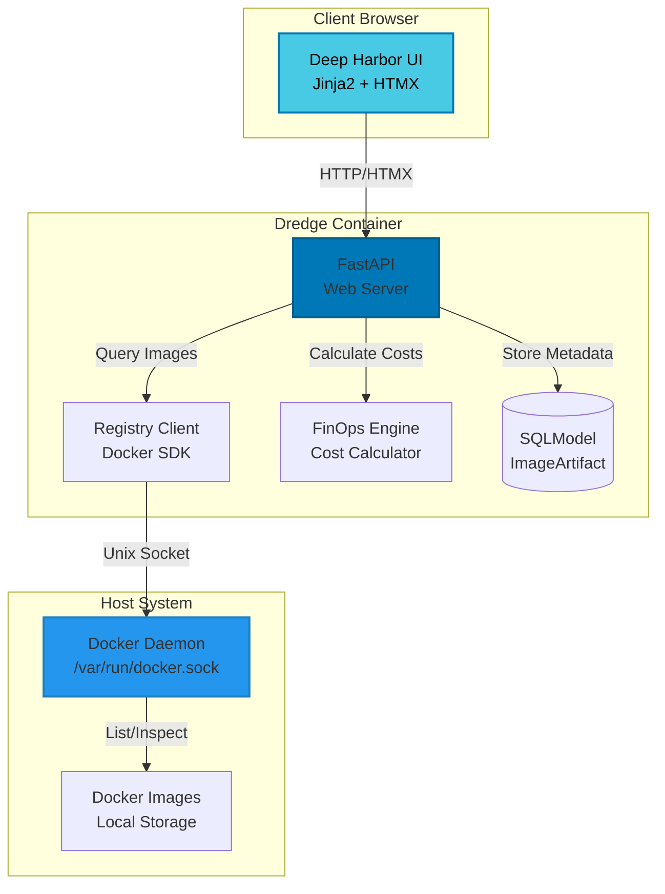
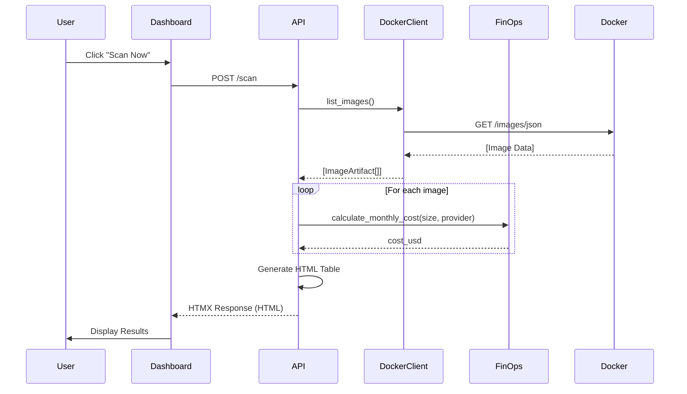
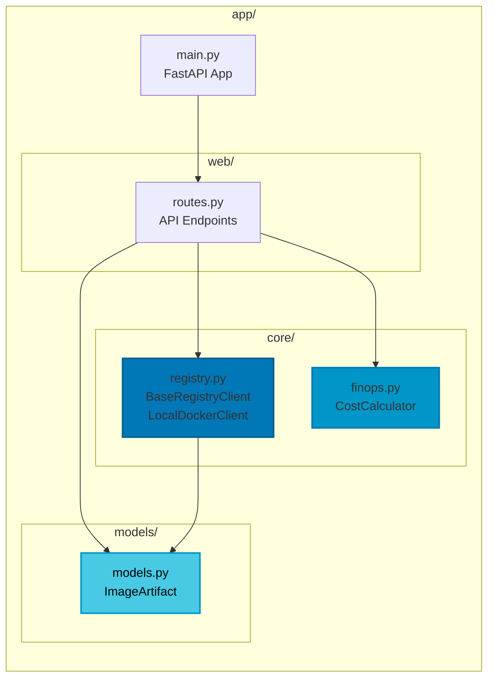

# 🌊 Dredge

<div align="center">

**Docker FinOps & Lifecycle Management Tool**

A powerful, nautical-themed platform for managing Docker infrastructure costs and optimizing image lifecycles.

[](https://www.docker.com/)
[](https://www.python.org/)
[](https://fastapi.tiangolo.com/)
[](LICENSE)

</div>

---

## 📑 Table of Contents

- [Overview](#-overview)
- [Features](#-features)
- [Architecture](#-architecture)
- [Tech Stack](#-tech-stack)
- [Quick Start](#-quick-start)
- [Installation](#-installation)
- [Usage](#-usage)
- [API Reference](#-api-reference)
- [Configuration](#-configuration)
- [Development](#-development)
- [Security](#-security)
- [Roadmap](#-roadmap)
- [Contributing](#-contributing)
- [License](#-license)

---

## 🌊 Overview

**Dredge** brings clarity to the murky waters of Docker infrastructure costs. Named after the maritime process of clearing sediment, Dredge helps you identify and remove unused Docker images, optimize storage, and track your cloud registry expenses.

### Why Dredge?

- 💰 **Cost Visibility**: Real-time calculation of monthly storage costs across AWS, Azure, and GCP
- 🔍 **Image Discovery**: Scan local and remote Docker registries instantly
- 📊 **FinOps Insights**: Track waste, efficiency scores, and reclaimable space
- 🎨 **Deep Harbor UI**: Beautiful dark nautical theme designed for long monitoring sessions
- 🐳 **Docker-Native**: Seamless integration with Docker daemon and registries

---

## ✨ Features

### Phase 1 (MVP) - Available Now ✅

| Feature | Description | Status |
|---------|-------------|--------|
| **Local Docker Scanning** | Scan images from `/var/run/docker.sock` | ✅ Live |
| **Cost Calculator** | AWS/Azure/GCP pricing with per-image breakdown | ✅ Live |
| **FinOps Dashboard** | KPI cards for waste, efficiency, and reclaimable space | ✅ Live |
| **Deep Harbor Theme** | Dark nautical UI with submarine control room aesthetics | ✅ Live |
| **HTMX Interactivity** | Real-time scanning without page reloads | ✅ Live |
| **Security Hardened** | XSS protection, input validation, secure error handling | ✅ Live |

### Phase 2 (Alpha) - Coming Soon 🚧

- 🗑️ **Quarantine Mode**: Soft-delete with 24-hour grace period
- 📋 **Cleanup Policies**: Automated rules (keep_count, max_age_days, regex whitelist)
- 📜 **Audit Logs**: Track every deletion with cost savings history
- 🔴 **Manual Purge**: Permanent deletion with dry-run mode

### Phase 3 (Beta) - Roadmap 📅

- 🌐 **Remote Registries**: Docker Hub, ECR, GCR, ACR support
- 📊 **Advanced Charts**: Storage trends, waste analysis, cost forecasting
- 📄 **PDF Reports**: Monthly FinOps summaries
- 🔔 **Alerting**: Notify when waste exceeds thresholds

---

## 🏗️ Architecture

### System Overview



### Data Flow



### Component Architecture



---

## 🛠️ Tech Stack

### Backend
- **[Python 3.11](https://www.python.org/)** - Core language
- **[FastAPI](https://fastapi.tiangolo.com/)** - High-performance async web framework
- **[Uvicorn](https://www.uvicorn.org/)** - ASGI server
- **[SQLModel](https://sqlmodel.tiangolo.com/)** - SQL databases + Pydantic models
- **[Docker SDK](https://docker-py.readthedocs.io/)** - Docker daemon integration
- **[Taskiq](https://taskiq-python.github.io/)** - Async background tasks (future use)

### Frontend
- **[Jinja2](https://jinja.palletsprojects.com/)** - Server-side templating
- **[HTMX](https://htmx.org/)** - Dynamic HTML without JavaScript
- **[PicoCSS](https://picocss.com/)** - Minimal CSS framework

### Infrastructure
- **[Docker](https://www.docker.com/)** - Containerization
- **[Docker Compose](https://docs.docker.com/compose/)** - Multi-container orchestration
- **[SQLite](https://www.sqlite.org/)** - Database (WAL mode)

### Development
- **[Pytest](https://pytest.org/)** - Testing framework
- **[Ruff](https://beta.ruff.rs/)** - Lightning-fast linter
- **[Mypy](https://mypy-lang.org/)** - Static type checker
- **[Bandit](https://bandit.readthedocs.io/)** - Security scanner

---

## 🚀 Quick Start

Get Dredge running in under 60 seconds:

```bash
# Clone the repository
git clone git@github.com:adam-benyekkou/Dredge.git
cd Dredge

# Start with Docker Compose
docker-compose up -d

# Open in browser
open http://localhost:8000
```

That's it! 🎉

---

## 📦 Installation

### Prerequisites

- **Docker** 20.10+ ([Install Docker](https://docs.docker.com/get-docker/))
- **Docker Compose** 2.0+ (included with Docker Desktop)
- **Git** (for cloning)

### Method 1: Docker Compose (Recommended)

```bash
# 1. Clone repository
git clone git@github.com:adam-benyekkou/Dredge.git
cd Dredge

# 2. Build and start
docker-compose up -d

# 3. Verify startup
docker-compose logs dredge

# Expected output:
# INFO:     Application startup complete.
# INFO:     Uvicorn running on http://0.0.0.0:8000
```

### Method 2: Local Development

```bash
# 1. Clone repository
git clone git@github.com:adam-benyekkou/Dredge.git
cd Dredge

# 2. Create virtual environment
python3.11 -m venv venv
source venv/bin/activate  # On Windows: venv\Scripts\activate

# 3. Install dependencies
pip install -e ".[dev]"

# 4. Run application
uvicorn app.main:app --reload

# 5. Access at http://localhost:8000
```

---

## 💻 Usage

### Dashboard

Access the main dashboard at `http://localhost:8000/`

**Features:**
- 📊 **KPI Cards**: Monthly Waste ($), Reclaimable Space (GB), Efficiency Score (%)
- 🔍 **Scan Now**: Instantly scan all Docker images on your host
- 🎛️ **Dry Run Toggle**: Preview changes without making modifications

### Scanning Images

1. Click **"Scan Now"** button on the dashboard
2. View results in the dynamic table:
   - Repository name
   - Image tag
   - Size (GB)
   - Created date
   - Monthly cost estimate
3. Analyze total storage and costs at the bottom

### API Endpoints

```bash
# Health check
curl http://localhost:8000/health

# Get dashboard (HTML)
curl http://localhost:8000/

# Scan images (HTMX endpoint)
curl -X POST http://localhost:8000/scan
```

---

## 📚 API Reference

### Health Check

**Endpoint:** `GET /health`

**Response:**
```json
{
  "status": "ok",
  "app": "Dredge",
  "version": "0.1.0"
}
```

### Dashboard

**Endpoint:** `GET /`

**Response:** HTML page with Jinja2 template

**Query Parameters:** None

### Scan Images

**Endpoint:** `POST /scan`

**Response:** HTML table rows (HTMX-compatible)

**Example Response:**
```html
<tr>
  <td><input type="checkbox" name="image-select" value="sha256:abc123..."></td>
  <td>nginx</td>
  <td>latest</td>
  <td>0.14 GB</td>
  <td>2026-02-16 12:00</td>
  <td><span class="badge safe">Safe</span></td>
  <td>$0.01/mo</td>
</tr>
```

### Images View

**Endpoint:** `GET /images`

**Response:** HTML page with image list template

---

## ⚙️ Configuration

### Environment Variables

Create a `.env` file (optional):

```bash
# Server Configuration
HOST=0.0.0.0
PORT=8000
LOG_LEVEL=INFO

# FinOps Pricing (USD per GB per month)
AWS_PRICE_PER_GB=0.10
AZURE_PRICE_PER_GB=0.13
GCP_PRICE_PER_GB=0.10

# Docker Socket (for custom paths)
DOCKER_SOCKET=/var/run/docker.sock
```

### Docker Compose Override

Create `docker-compose.override.yml` for custom configurations:

```yaml
services:
  dredge:
    environment:
      - LOG_LEVEL=DEBUG
    ports:
      - "9000:8000"  # Use custom port
    volumes:
      - ./custom-path:/data  # Add custom volume
```

---

## 🔧 Development

### Setup Development Environment

```bash
# Clone and enter directory
git clone git@github.com:adam-benyekkou/Dredge.git
cd Dredge

# Install with dev dependencies
pip install -e ".[dev]"

# Run tests
pytest tests/ -v

# Run linter
ruff check app/

# Run type checker
mypy app/

# Run security scanner
bandit -r app/
```

### Project Structure

```
Dredge/
├── app/
│   ├── __init__.py           # Package initialization
│   ├── main.py               # FastAPI entrypoint
│   ├── models.py             # SQLModel domain models
│   ├── core/
│   │   ├── __init__.py
│   │   ├── registry.py       # Docker registry abstraction
│   │   └── finops.py         # Cost calculation engine
│   └── web/
│       ├── __init__.py
│       └── routes.py         # API endpoints
├── templates/
│   ├── layout.html           # Base template
│   ├── dashboard.html        # Dashboard view
│   └── images.html           # Images list view
├── static/                   # Static assets (empty for now)
├── tests/
│   ├── __init__.py
│   └── test_e2e.py          # End-to-end tests
├── docker-compose.yml        # Docker Compose configuration
├── Dockerfile               # Container definition
├── pyproject.toml           # Python project metadata
├── pytest.ini               # Pytest configuration
└── README.md                # This file
```

### Running Tests

```bash
# All tests
pytest

# Specific test file
pytest tests/test_e2e.py -v

# With coverage
pytest --cov=app tests/

# Only fast tests
pytest -m "not slow"
```

### Code Quality Checks

```bash
# Linting
ruff check app/

# Auto-fix linting issues
ruff check app/ --fix

# Type checking
mypy app/

# Security scanning
bandit -r app/

# Dependency vulnerabilities
safety check
```

---

## 🔒 Security

### Security Features

✅ **XSS Protection**: All user-controlled data is HTML-escaped  
✅ **Input Validation**: SHA256 digest format validation with regex  
✅ **Error Handling**: Generic user messages, detailed internal logging  
✅ **Secure Logging**: Structured logs without sensitive data exposure  
✅ **Clean Security Scan**: Zero issues reported by Bandit  

### Known Security Considerations

⚠️ **Docker Socket Access**: The container has full access to the host Docker daemon via `/var/run/docker.sock`. This is:
- ✅ **Acceptable** for local development
- ❌ **NOT recommended** for production without additional isolation

**For Production Deployment:**
1. Use Docker-in-Docker (DinD) pattern
2. Implement Docker API gateway with authentication
3. Run container with read-only root filesystem
4. Add rate limiting and authentication
5. Enable HTTPS/TLS termination

### Reporting Security Issues

Please report security vulnerabilities via email to: **security@dredge.io**

**DO NOT** create public GitHub issues for security vulnerabilities.

---

## 🗺️ Roadmap

### Phase 2: Alpha - The Reaper (Q2 2026)

- [ ] Quarantine mode (24-hour grace period)
- [ ] Cleanup policies (keep_count, max_age, regex)
- [ ] Audit logging for all deletions
- [ ] Manual purge with dry-run support

### Phase 3: Beta - FinOps (Q3 2026)

- [ ] Remote registry support (Docker Hub, ECR, GCR, ACR)
- [ ] Advanced charts and visualizations
- [ ] PDF report generation
- [ ] Email/Slack notifications

### Phase 4: Production (Q4 2026)

- [ ] Multi-user authentication (OAuth2)
- [ ] Role-based access control (RBAC)
- [ ] Multi-registry dashboard
- [ ] Cost optimization recommendations
- [ ] Scheduled cleanup automation

---

## 🤝 Contributing

We welcome contributions! Please follow these guidelines:

### Development Workflow

1. **Fork** the repository
2. **Create** a feature branch (`git checkout -b feature/amazing-feature`)
3. **Commit** your changes using [Conventional Commits](https://www.conventionalcommits.org/)
4. **Test** your changes (`pytest tests/`)
5. **Push** to your branch (`git push origin feature/amazing-feature`)
6. **Open** a Pull Request

### Commit Message Format

```
<type>(<scope>): <subject>

<body>
```

**Types:** feat, fix, docs, style, refactor, test, chore

**Example:**
```
feat(finops): add GCP pricing support

- Add GCP_PRICE_PER_GB constant
- Update calculate_monthly_cost() to support GCP
- Add unit tests for GCP pricing
```

### Code Style

- Follow **PEP 8** guidelines
- Use **type hints** everywhere
- Write **docstrings** for all public functions
- Maintain **100% test coverage** for new features
- Pass **all linters** (ruff, mypy, bandit)

---

## 📄 License

This project is licensed under the **MIT License** - see the [LICENSE](LICENSE) file for details.

---

## 🙏 Acknowledgments

- **Deep Harbor Theme** inspired by submarine control rooms and maritime aesthetics
- **Docker** for revolutionizing containerization
- **FastAPI** for the incredible developer experience
- **HTMX** for bringing interactivity back to the server

---

## 📞 Contact & Support

- **GitHub Issues**: [Report bugs or request features](https://github.com/adam-benyekkou/Dredge/issues)
- **Email**: support@dredge.io
- **Documentation**: [Full docs](https://docs.dredge.io) *(coming soon)*

---

<div align="center">

**Made with ❤️ by the Dredge Team**

[⬆ Back to Top](#-dredge)

</div>
