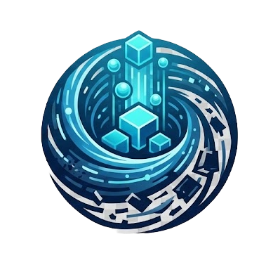
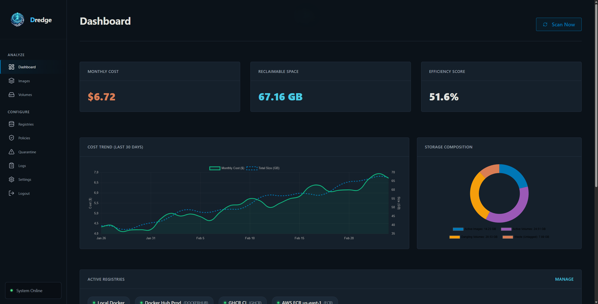
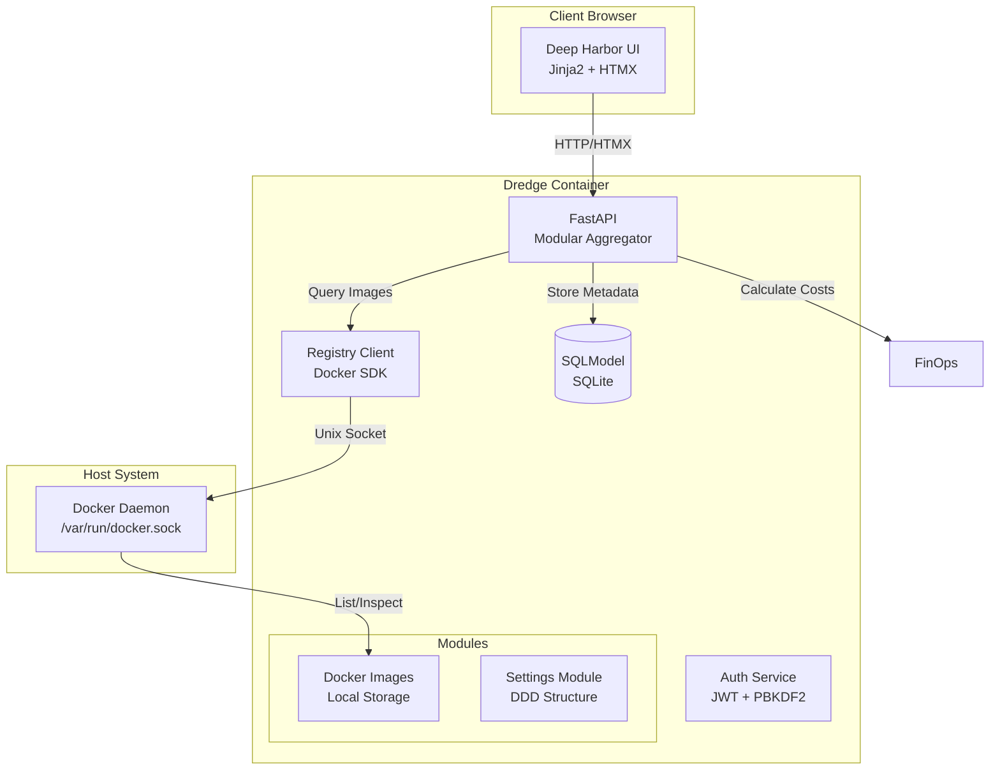
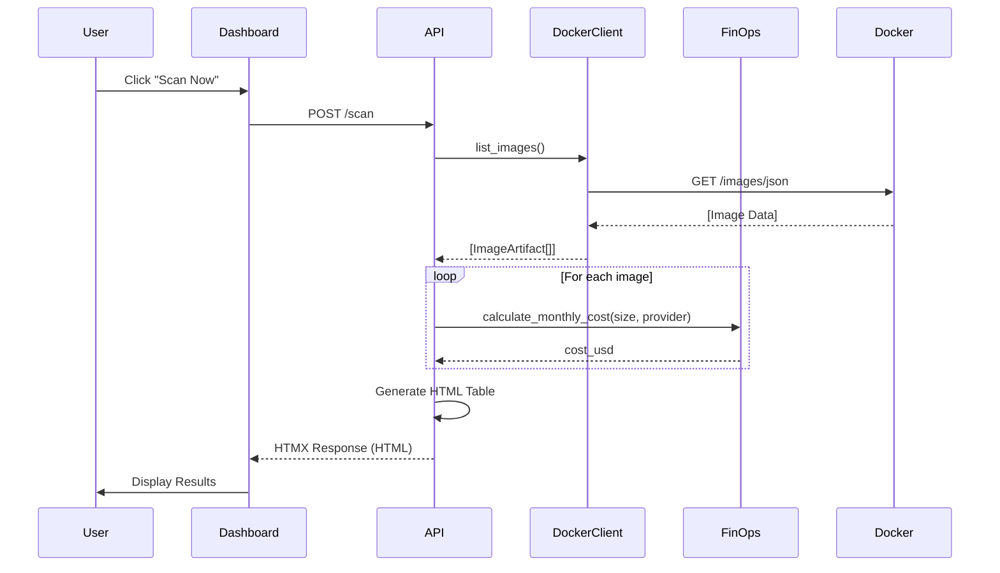

# 🌊  Dredge

<div align="center">

**Docker FinOps & Lifecycle Management Tool**

A powerful, nautical-themed platform for managing Docker infrastructure costs and optimizing image lifecycles.

[](https://www.docker.com/)
[](https://www.python.org/)
[](https://fastapi.tiangolo.com/)
[](LICENSE)

[📖 Documentation](https://adam-benyekkou.github.io/Dredge/) • [Quick Start](#quick-start)

</div>

## 🌊 What is Dredge?


**Dredge** brings clarity to the murky waters of Docker infrastructure costs. Named after the maritime process of clearing sediment, Dredge helps you identify and remove unused Docker images, optimize storage, and track your cloud registry expenses.

### Key Features

- 💰 **Cost Visibility** - Real-time calculation of monthly storage costs with provider-specific pricing (Docker Hub, GHCR, etc.)
- 🔍 **Multi-Registry Support** - Real API integration for scanning and deleting images from Local Docker, Docker Hub, and GHCR.
- 📊 **FinOps Dashboard** - Track waste, efficiency scores, and reclaimable space with lazy-loaded, high-performance views.
- 📈 **Cost Trends** - Visualize historical spending patterns with interactive line charts and daily snapshots.
- 📦 **Bloat Detection** - Automatically identify oversized images and unoptimized base layers with smart recommendations.
- 🔔 **Smart Alerts** - Receive notifications via Slack/Discord when monthly budget thresholds are exceeded.
- 🗑️ **Mass Cleanup** - Batch delete images across multiple registries with asynchronous background processing.
- 🛡️ **Lifecycle Policies** - Automated quarantine logic with preview-before-action safety, based on image age and count per repository.
- 🤖 **Automation** - Schedule cleanup policies to run automatically via cron (Daily, Weekly, Monthly).
- 🔒 **Quarantine Management** - Dedicated quarantine page with bulk operations (unquarantine/purge) and real-time count updates.
- 🔐 **JWT Security** - Secure access with JSON Web Token authentication and PBKDF2-SHA256 password hashing.
- 📡 **Health Monitoring** - Automated registry health checks with proactive 5-minute pings and auto-disable for broken connections.
- 🎨 **Deep Harbor UI** - Beautiful dark nautical theme with real-time toast notifications and interactive forms.

## 🛠️ Tech Stack

**Backend:** Python 3.11 • FastAPI • SQLModel • Docker SDK • JWT (python-jose)  
**Frontend:** HTMX • Jinja2 • Custom CSS (Deep Harbor theme)  
**Infrastructure:** Docker • Docker Compose • SQLite

## Quick Start

```bash
git clone https://github.com/adam-benyekkou/Dredge.git
cd Dredge
docker-compose up -d
```

Open [http://localhost:8000](http://localhost:8000) to access the dashboard.

**That's it!** 🎉

For detailed installation, configuration, and usage instructions, see the [📖 Documentation](https://adam-benyekkou.github.io/Dredge/).

## 🔒 Security

Dredge uses secure authentication practices to protect your infrastructure data:

- **JWT Authentication**: All API and UI routes are protected by JSON Web Tokens.
- **Password Hashing**: Passwords are hashed using the secure PBKDF2-SHA256 algorithm.
- **Default Credentials**: The initial installation uses `admin` / `admin`. **Change these immediately** in the **Settings > General** tab.
- **Secure Storage**: External registry credentials are encrypted at rest in the database.

## 📚 Documentation

For comprehensive guides, API reference, and deployment instructions, visit:

### [📖 https://adam-benyekkou.github.io/Dredge/](https://adam-benyekkou.github.io/Dredge/)

**What's in the docs:**
- Getting Started Guide
- Configuration & Environment Setup
- Registry Provider Setup (AWS ECR, GCP GAR, Docker Hub, etc.)
- Core Concepts (Images, Volumes, Policies, FinOps)
- Production Deployment Guide
- API Reference

## Architecture

### System Overview

Dredge follows a **Modular Domain-Driven Design (DDD)** architecture, where logic is divided into self-contained feature modules (Images, Settings, etc.).



### Data Flow



---

## 📄 License

This project is licensed under the **MIT License** - see the [LICENSE](LICENSE) file for details.

---

<div align="center">

**Made with ❤️ by the Dredge Team**

[⬆ Back to Top](#-dredge)

</div>
