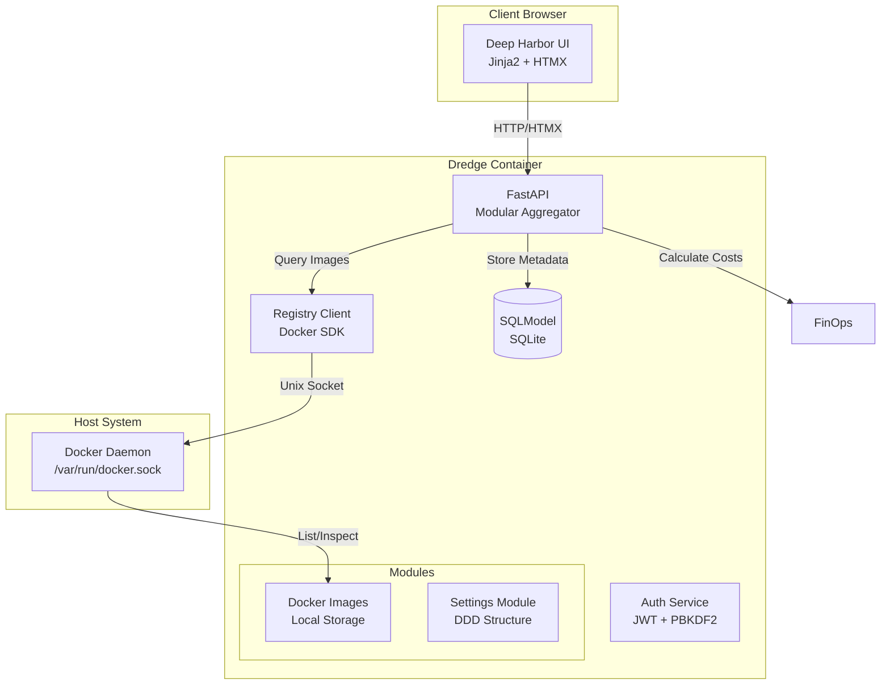
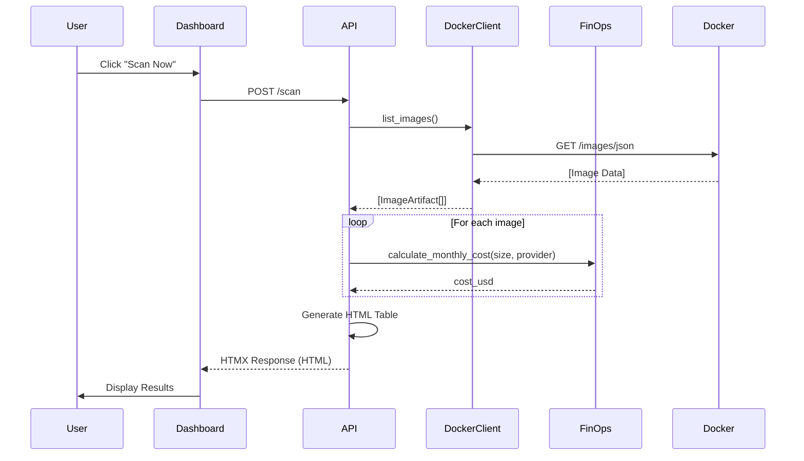

# Architecture

Dredge follows a **Modular Domain-Driven Design (DDD)** architecture, where logic is divided into self-contained feature modules (Images, Settings, etc.).

## System Overview

## Data Flow

