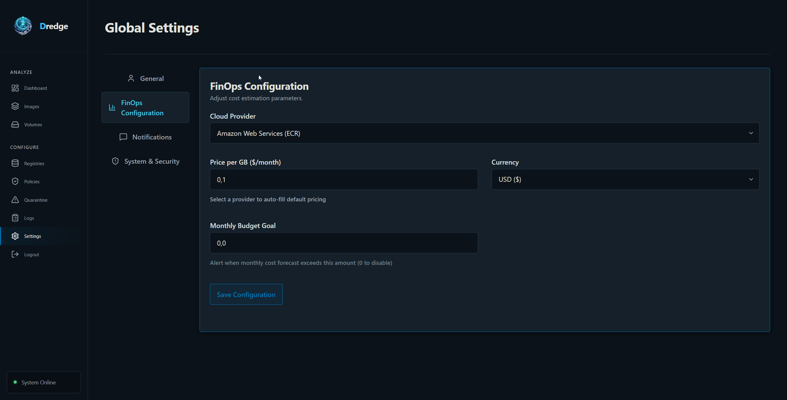
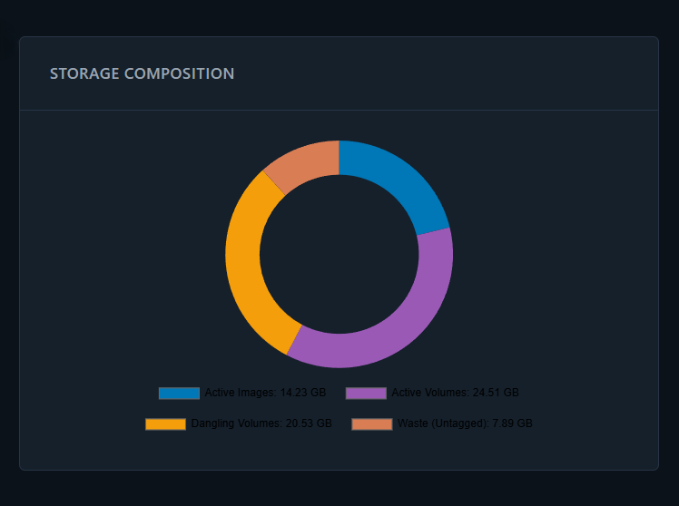

# FinOps Metrics

Dredge surfaces three key metrics on the dashboard to help you understand and control your Docker storage costs.

---


**What it is:** The estimated total storage cost for all tracked resources — images and volumes — billed at your configured provider rates.

**Formula:**
```
Monthly Cost = Σ (resource_size_gb × price_per_gb)
```
Applied to every image and every volume in the database, using provider-specific pricing from FinOps settings.

**Provider pricing (defaults):**

| Provider | Price/GB/month |
|---|---|
| AWS ECR | $0.10 |
| Azure ACR | $0.09 |
| GCP GAR | $0.026 |
| Docker Hub | $0.00 (fair use) |
| GHCR (GitHub Packages) | $0.25 |
| GitHub HRC (Actions Cache) | $0.07 |
| Custom | configurable |

Configure your provider and rate in **Settings → FinOps**.

---

## Reclaimable Space

**What it is:** Total GB across all tracked images and volumes. This is the raw storage footprint — the upper bound of what could be reclaimed if all resources were deleted.

**Formula:**
```
Reclaimable Space = Σ image.size_gb + Σ volume.size_gb
```

---

## Efficiency Score

**What it is:** The percentage of your total storage that is actively used — not wasted on untagged images or dangling volumes.

**Formula:**
```
active_resources_gb  =  (images_gb − waste_gb) + active_volumes_gb
total_resources_gb   =  images_gb + active_volumes_gb + dangling_volumes_gb + waste_gb

Efficiency = (active_resources_gb / total_resources_gb) × 100
```

**What lowers efficiency:**
- **Waste (Untagged images):** Images with no tags or `<none>:<none>` tags — leftovers from builds, not in active use.
- **Dangling volumes:** Volumes not attached to any running container.

**Interpretation:**
| Score | Meaning |
|---|---|
| 90–100% | Healthy — very little waste |
| 70–89% | Moderate — some cleanup worthwhile |
| < 70% | Poor — significant untagged/dangling resources to purge |

---

## Storage Composition Chart
## Storage Composition Chart


| Segment | Color | Definition |
|---|---|---|
| **Active Images** | Blue | Tagged images with valid, non-`<none>` tags |
| **Active Volumes** | Purple | Volumes with status `ACTIVE` (attached to a container) |
| **Dangling Volumes** | Amber | Volumes with status `DANGLING` (not attached to any container) |
| **Waste (Untagged)** | Rust/Coral | Images with no tags, empty tag list, or `<none>:<none>` tags — orphaned build layers |

---

## Cost Trend Chart

The line chart shows a **hypothetical 30-day projection** based on your current costs. It simulates how costs would look if your current resource footprint had grown linearly from ~60% of today's total over the past month, with organic variation to illustrate realistic usage patterns.

> This chart is a planning aid, not historical data. It anchors to today's real measured cost and size.

---

## Budget Tracking

Set a monthly budget in **Settings → FinOps**. The dashboard will show a progress bar and alert you when spending approaches or exceeds the limit.

| Budget State | Indicator |
|---|---|
| Under 75% | Green bar |
| 75–100% | Amber bar |
| Over 100% | Red bar + overage amount |
