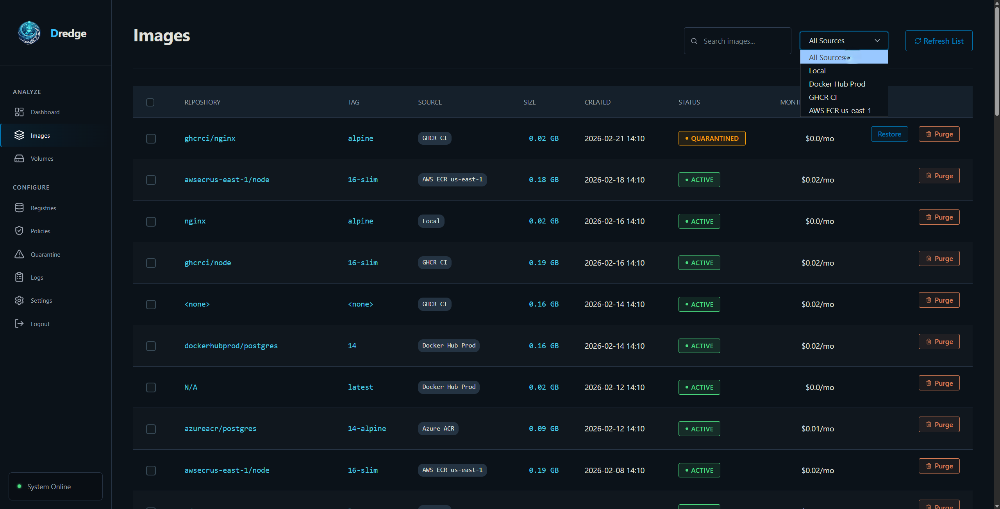
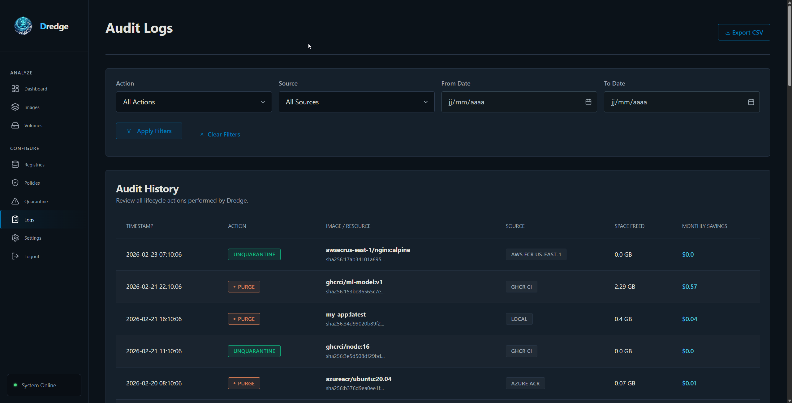

# Images

Dredge tracks Docker images across local and remote registries, assigning each a status and surfacing relevant badges in the UI.

---

## Image Statuses

### Active
The image is present and tracked in Dredge's database. It may or may not be in use by a running container — Dredge does not introspect container usage at this time.

### Quarantined
The image has been flagged by a cleanup policy. It enters a **24-hour grace period** before it can be permanently purged. During this window you can review and restore it if needed.

### Purged
The image record has been permanently removed from Dredge's database. This does **not** delete the image from the actual Docker registry — use the Images page "Delete" action for that.

---

## Badges

Badges appear in the image table to communicate status at a glance.

### Status Badges

| Badge | Color | Meaning |
|---|---|---|
| **Active** | Green | Image is in normal tracked state |
| **Quarantined** | Amber | Flagged by policy, pending review or purge |
| **Purged** | Red/Coral | Removed from Dredge's database |

### Tag Badges

| Badge | Color | Meaning |
|---|---|---|
| `<tag name>` | Blue | A valid image tag (e.g. `myapp:latest`) |
| **Untagged** | Muted/grey | Image has no tags — a dangling build layer, counts as Waste in the composition chart |

---

## Untagged Images (Waste)

An image is considered **waste** when:
- It has no tags at all (`tags = []`)
- Its only tag is `<none>:<none>`
- Any of its tags contains `<none>` (e.g. intermediate build layers)

These images are included in the **Waste (Untagged)** segment of the Storage Composition chart and lower the Efficiency Score. They are safe to delete.

---

## Actions

### Delete
Removes the image from the Docker registry (or Dredge's tracking for remote images). This is a permanent, destructive action.

### Quarantine
Moves the image to `QUARANTINED` status via a cleanup policy. Triggers the 24-hour grace period.

### Restore
Returns a quarantined image to `ACTIVE` status. Available from the Quarantine page. Clears the expiration timer.

### Purge
Permanently removes a quarantined image record from Dredge's database. Available from the Quarantine page. Does **not** remove the image from the registry.

> **Purge vs Delete:** Purge removes the record from Dredge. Delete removes the actual image from the Docker registry. To fully remove an image, do both.

---
## Audit Logs

Every destructive action (Delete/Purge) is logged. You can filter logs by action, source, or date.

---

## Bloat Score
| 0–49 | Highly bloated — significant layer waste |

Images with a bloat score below 80 appear in the "Top Bloated Images" section of the dashboard.
