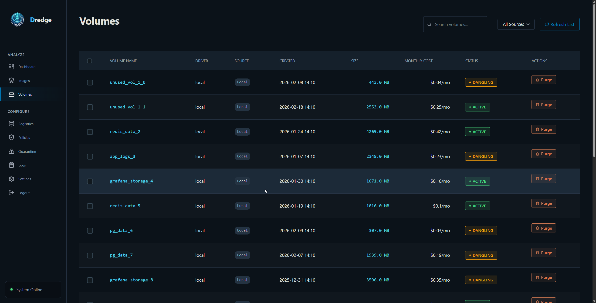

# Volumes

Docker volumes persist data generated by and used by containers. Dredge scans for volumes on the local Docker daemon and tracks their status, size, and cost.

---

## Volume Statuses

### Active
The volume is attached to at least one running or stopped container. It is in use and should not be removed without understanding what data it holds.

### Dangling
The volume is **not** attached to any container. It is an orphan — typically left over after a container was deleted without its volumes being cleaned up. Dangling volumes are safe to remove in most cases but should be reviewed before purging.

---

## Badges

### Status Badges

| Badge | Color | Meaning |
|---|---|---|
| **Active** | Green | Volume is associated with a container |
| **Dangling** | Amber | Volume has no container association — orphaned |

---

## Storage Composition

Volumes appear in two distinct segments of the dashboard's Storage Composition donut chart:

| Segment | Color | Which volumes |
|---|---|---|
| **Active Volumes** | Purple | Volumes with status `ACTIVE` |
| **Dangling Volumes** | Amber | Volumes with status `DANGLING` |

Dangling volumes reduce the **Efficiency Score** because they consume storage without serving any active workload.

---

## Actions

### Purge (single)
Deletes the volume from Docker and removes its record from Dredge's database. Only available for dangling volumes — active volumes should be detached first.

### Batch Purge
Select multiple volumes via checkboxes and purge them in one operation. Useful for cleaning up large numbers of dangling volumes at once.

---

## Cost

Volume storage cost is calculated the same way as images:

```
Volume Monthly Cost = volume_size_gb × price_per_gb
```

Pricing uses the provider configured in **Settings → FinOps**. Since volumes are always local, they use the default/custom price unless overridden.

---

## Best Practices

- **Review before purging:** Dangling does not always mean safe to delete. A volume may hold important data from a container that was stopped and not yet restarted.
- **Named volumes:** Named volumes (e.g. `postgres_data`) are more likely to hold important persistent data than anonymous volumes (random hash names).
- **Regular cleanup:** Running periodic scans and purging truly orphaned volumes keeps your Efficiency Score high and reduces unnecessary storage costs.
